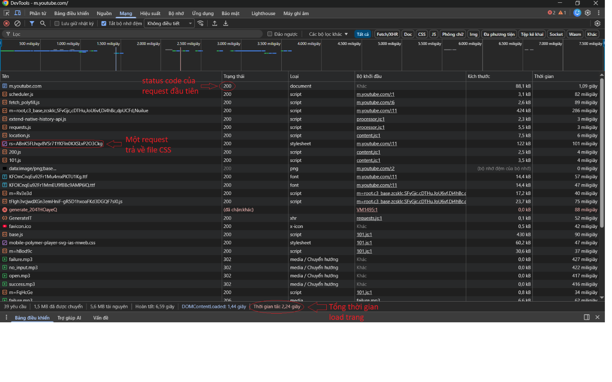
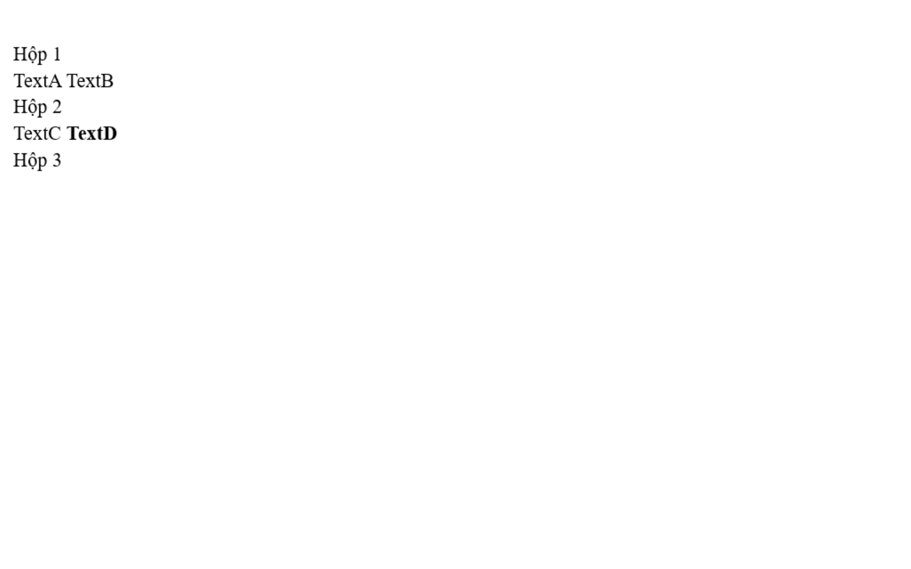
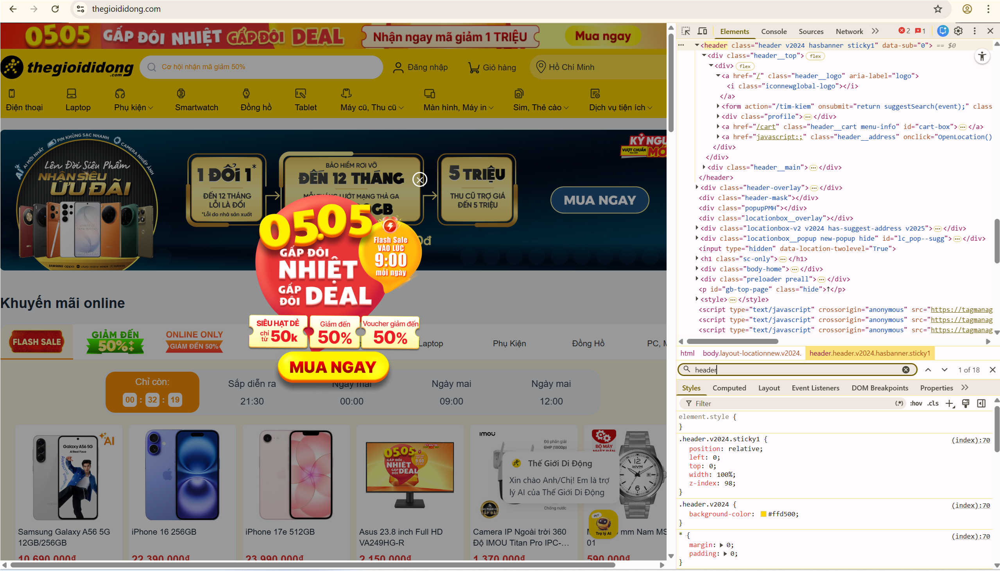
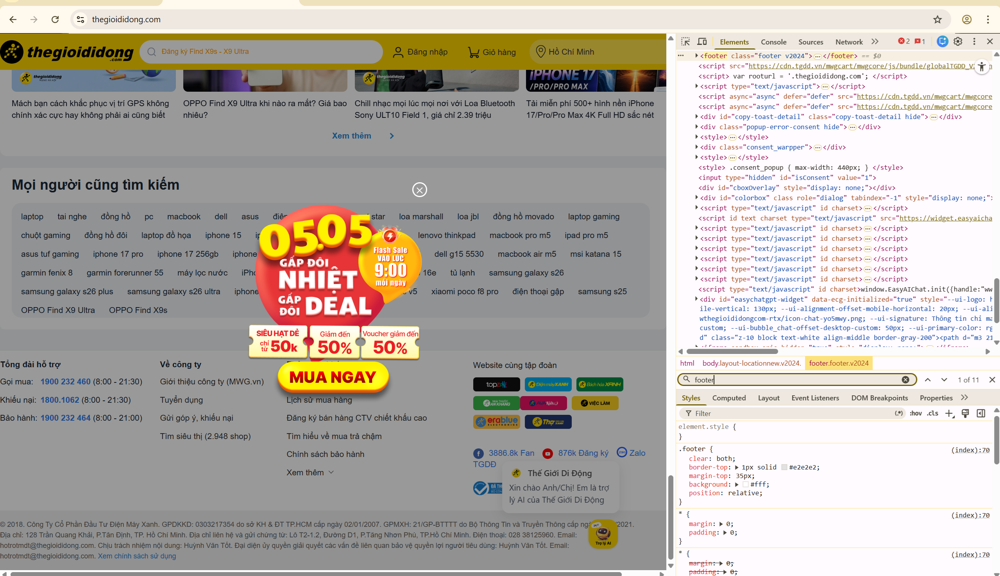
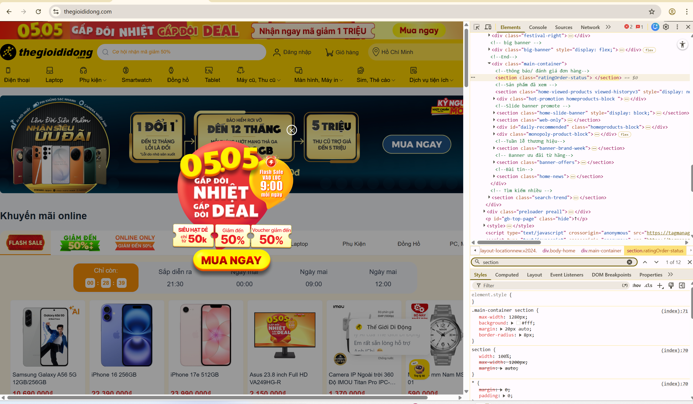
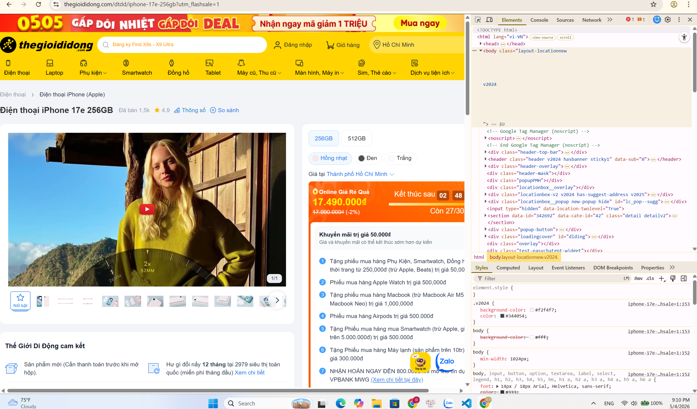
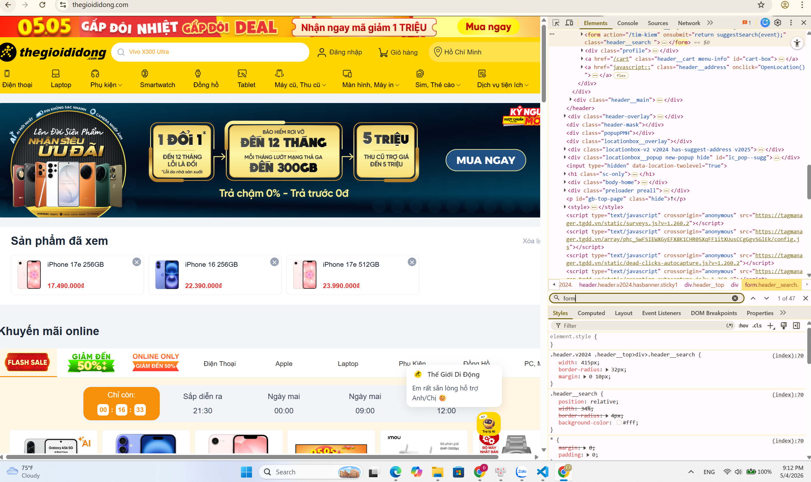

## Câu A1

1 — Các bước khi truy cập website  

**Bước 1: DNS lookup**  
Trình duyệt tìm địa chỉ IP của tên miền shopee.vn  

**Bước 2: Thiết lập kết nối TCP**  
Tạo kết nối giữa máy người dùng và server (3-way handshake)  

**Bước 3: TLS Handshake**  
Thiết lập kết nối bảo mật (HTTPS, mã hóa dữ liệu)  

**Bước 4: Gửi HTTP request**  
Trình duyệt gửi yêu cầu (GET) đến server  

**Bước 5: Server xử lý**  
Server xử lý request (có thể truy vấn database)  

**Bước 6: Trả về HTTP response**  
Server trả về HTML, CSS, JS và status code  

**Bước 7: Parse HTML**  
Trình duyệt phân tích HTML và tạo DOM  

**Bước 8: Tải tài nguyên phụ**  
Tiếp tục tải CSS, JS, hình ảnh  

**Bước 9: Tạo render tree**  
Kết hợp DOM và CSS để dựng cấu trúc hiển thị  

**Bước 10: Render trang**  
Hiển thị nội dung hoàn chỉnh lên màn hình  

Tài liệu: tuan_1_html5/01_introduction_html_universe.md - phần 1.Web hoạt động như thế nào?  

---

### 2  


---

## Câu A2

Theo chuơng 04, trang web bị Google đánh giá SEO thấp vì sử dụng tình trạng "Div Soup" (chỉ dùng thẻ `<div>` cho mọi thứ), khiến Google Bot và các công cụ hỗ trợ đọc (Screen Reader) không thể hiểu được cấu trúc và ý nghĩa của từng phần nội dung.  

Một số lỗi semantic và cách sửa như sau:  

**Lỗi 1:** Phần đầu trang dùng `<div class="header">`  
→ Nên đổi thành `<header>` để đúng vai trò phần đầu trang.  

**Lỗi 2:** Khu vực menu dùng `<div class="menu">`  
→ Nên thay bằng `<nav>` vì đây là phần điều hướng.  

**Lỗi 3:** Nội dung chính dùng `<div class="main">`  
→ Nên đổi thành `<main>` để thể hiện nội dung chính của trang.  

**Lỗi 4:** Mỗi sản phẩm dùng `<div class="product">`  
→ Nên dùng `<article>` vì đây là một nội dung độc lập.  

**Lỗi 5:** Phần cuối trang dùng `<div class="footer">`  
→ Nên thay bằng `<footer>` để đúng semantic HTML5.  

Tài liệu: tuan_1_html5/04_visible_part_html.md  

---

## Câu A3  



Các thẻ `<div>` là dạng block  
→ nghĩa là mỗi thẻ sẽ chiếm một dòng riêng, nên “Hộp 1”, “Hộp 2”, “Hộp 3” sẽ tự động xuống dòng  

Các thẻ `<span>` và `<strong>` là dạng inline  
→ nghĩa là chúng không xuống dòng, mà nằm chung trên một hàng  

Cho nên là:  

“Text A” và “Text B” nằm trong `<span>` nên đứng cùng một dòng  
“Text C” và “Text D” cũng vậy, vẫn nằm trên cùng một dòng  

`<strong>` chỉ làm chữ đậm chứ không làm xuống dòng  

Các `<div>` thì luôn tách thành từng khối riêng  

Tài liệu: tuan_1_html5/02_basic_structure_html.md  

---

## Câu A4

Trong một bảng HTML, các thẻ này dùng để chia cấu trúc rõ ràng hơn:  

`<thead>`: là phần tiêu đề của bảng  
→ thường chứa tên các cột (ví dụ: Tên, Giá, Mô tả)  

`<tbody>`: là phần nội dung chính của bảng  
→ chứa dữ liệu thật của từng dòng  

`<tfoot>`: là phần tổng kết hoặc ghi chú cuối bảng  
→ ví dụ: tổng tiền, ghi chú, trung bình,...  

---

### 3 lý do KHÔNG NÊN dùng table để tạo layout trang web:

Thứ nhất: Khó responsive  
→ Table không linh hoạt trên điện thoại, hiển thị rất xấu khi co màn hình  

Thứ hai: Sai mục đích sử dụng  
→ Table sinh ra để hiển thị dữ liệu dạng bảng, không phải để chia bố cục trang  

Thứ ba: Khó bảo trì code  
→ Layout bằng table rất rối, sửa một chỗ dễ ảnh hưởng cả bố cục  

Thứ tư: SEO và accessibility kém hơn  
→ Google và screen reader khó hiểu cấu trúc trang nếu lạm dụng table  

---

## CÂU B3 

**Lỗi 1:** Dòng 1 — Phần khai báo DOCTYPE chưa đúng chuẩn HTML5  
→ Cách sửa: Đổi `<!DOCTYPE>` thành `<!DOCTYPE html>`  

**Lỗi 2:** Dòng 2 — Thẻ `<html>` chưa có thông tin về ngôn ngữ  
→ Cách sửa: Đổi `<html>` thành `<html lang="vi">`  

**Lỗi 3:** Dòng 4 — Thiếu thẻ đóng cho phần tiêu đề trang  
→ Cách sửa: Thêm thẻ `</title>` vào cuối dòng  

**Lỗi 4:** Dòng 5 — Giá trị charset chưa đúng định dạng chuẩn  
→ Cách sửa: Đổi `<meta charset="utf8">` thành `<meta charset="UTF-8">`  

**Lỗi 5:** Dòng 8 — Thẻ `<h1>` viết sai cú pháp và chưa đặt đúng vị trí  
→ Cách sửa: Sửa `<h1>...<h1>` thành `<h1>...</h1>` và di chuyển vào `<header>`  

**Lỗi 6:** Dòng 12 — Thẻ `<a>` chưa đóng đúng  
→ Cách sửa: Đổi thành `</a>`  

**Lỗi 7:** Dòng 19 & 26 — Sai thứ tự heading  
→ Cách sửa: Đổi `<h3>` thành `<h2>`  

**Lỗi 8:** Dòng 20 — Thẻ `` thiếu thuộc tính  
→ Cách sửa: ``  

**Lỗi 9:** Dòng 22 — Lỗi lồng thẻ  
→ Cách sửa: `<p>Giá: <strong>25.990.000đ</strong></p>`  

**Lỗi 10:** Dòng 29 & 30 — Sai thẻ bảng  
→ Cách sửa: dùng `<th>`, `<thead>`, `<tbody>`  

**Lỗi 11:** Dòng 40 — 2 thẻ `<main>`  
→ Cách sửa: đổi thẻ thứ 2 thành `<aside>`  

**Lỗi 12:** Dòng 45 — Thiếu `</p>`  

**Lỗi 13:** Dòng 47 — Thiếu `</html>`  

---

## CÂU B4

em chọn thegioididong  
Trang được chọn: thegioididong  

Các thẻ semantic HTML5 tìm được:  

Thẻ `<header>`: nằm ở phần đầu trang, chứa logo, thanh tìm kiếm và menu điều hướng  
Thẻ `<section>`: dùng để chia các khu vực nội dung  
Thẻ `<footer>`: nằm ở cuối trang  

  
  
  

---

Các phần chưa dùng đúng semantic:

- Trang sử dụng thẻ `<div>` cho header  
- Một số khu vực vẫn dùng `<div>` thay vì `<section>`  



---

Phân tích Form (ô tìm kiếm):

Form tìm kiếm nằm ở phần header của trang  

action: `/tim-kiem`  
method: GET (mặc định)  

Các input type:  
- text : ô nhập từ khóa tìm kiếm
- hidden: dùng để lưu dữ liệu ẩn (ví dụ: )



---

## Câu C1
```html
<!DOCTYPE html>
<html lang="vi">
<head>
  <meta charset="UTF-8"> <!-- bảng mã -->
  <meta name="viewport" content="width=device-width, initial-scale=1.0"> <!-- responsive -->
  <title>Product Detail</title>
</head>
<body>

  <!-- HEADER + NAVIGATION -->
  <header>
    <nav> <!-- điều hướng chính -->
      <ul>
        <li><a href="#">Trang chủ</a></li>
        <li><a href="#">Danh mục</a></li>
      </ul>
    </nav>
  </header>

  <!-- BREADCRUMB -->
  <nav aria-label="breadcrumb">
    <ol> <!-- breadcrumb có thứ tự -->
      <li><a href="#">Trang chủ</a></li>
      <li><a href="#">Điện thoại</a></li>
      <li>iPhone 16</li>
    </ol>
  </nav>

  <!-- MAIN CONTENT -->
  <main>

    <!-- WRAPPER: chứa section chính và sidebar cùng cấp -->
    <div>

      <!-- SECTION: ảnh + thông tin sản phẩm -->
      <section>

        <!-- ARTICLE: ảnh sản phẩm -->
        <article>
          <figure> <!-- nhóm ảnh chính -->
            
            <figcaption>Ảnh sản phẩm</figcaption>
          </figure>

          <!-- danh sách ảnh phụ -->
          <div>
            
            
            
            
            
          </div>
        </article>

        <!-- ARTICLE: thông tin sản phẩm -->
        <article>
          <h1>Tên sản phẩm</h1>
          <p>Giá</p>
          <div>Đánh giá sao</div>
          <p>Mô tả</p>
        </article>

      </section>

      <!-- SIDEBAR: cùng cấp với section -->
      <aside> <!-- nội dung phụ -->
        <h2>Sản phẩm tương tự</h2>
        <ul>
          <li><a href="#">SP 1</a></li>
        </ul>
      </aside>

    </div>

    <!-- SECTION: bảng thông số -->
    <section>
      <h2>Thông số kỹ thuật</h2>
      <table>
        <tr>
          <th>Thuộc tính</th>
          <th>Giá trị</th>
        </tr>
        <tr>
          <td>...</td>
          <td>...</td>
        </tr>
      </table>
    </section>

    <!-- SECTION: đánh giá / bình luận -->
    <section>
      <h2>Đánh giá</h2>

      <!-- form nhập -->
      <form>
        <textarea></textarea>
        <button type="submit">Gửi</button>
      </form>

      <!-- danh sách bình luận -->
      <div>
        <article>
          <p>Tên</p>
          <p>Nội dung</p>
        </article>
      </div>
    </section>

    <!-- SIDEBAR -->
    <aside> <!-- nội dung phụ -->
      <h2>Sản phẩm tương tự</h2>
      <ul>
        <li><a href="#">SP 1</a></li>
      </ul>
    </aside>

  </main>

  <!-- FOOTER -->
  <footer>
    <p>Footer</p>
  </footer>

</body>
</html>
```


## Câu C2

Mình không đồng ý với ý kiến chỉ dùng <div> cho mọi thứ. Vì thứ nhất là SEO, các thẻ semantic như <header>, <main>, <article> giúp Google hiểu cấu trúc trang tốt hơn. Nếu dùng toàn <div> thì máy tìm kiếm khó biết đâu là nội dung chính.  

Thứ hai là accessibility. Người dùng dùng screen reader sẽ dựa vào các thẻ như <nav> hay <main> để di chuyển nhanh trong trang. Nếu chỉ dùng <div> thì trải nghiệm sẽ kém.  

Ví dụ, khi dùng <article> cho mỗi sản phẩm hoặc bài viết thì cả Google và screen reader đều hiểu đó là một nội dung độc lập. Còn nếu dùng <div> thì phải dựa vào class, mà class không có ý nghĩa chuẩn.  

Tuy nhiên <div> vẫn cần thiết trong một số trường hợp như chia layout (flex, grid) hoặc nhóm các phần tử lại mà không cần ý nghĩa cụ thể.  

=> Kết luận: nên kết hợp semantic HTML và <div>, không nên dùng <div> cho tất cả.
