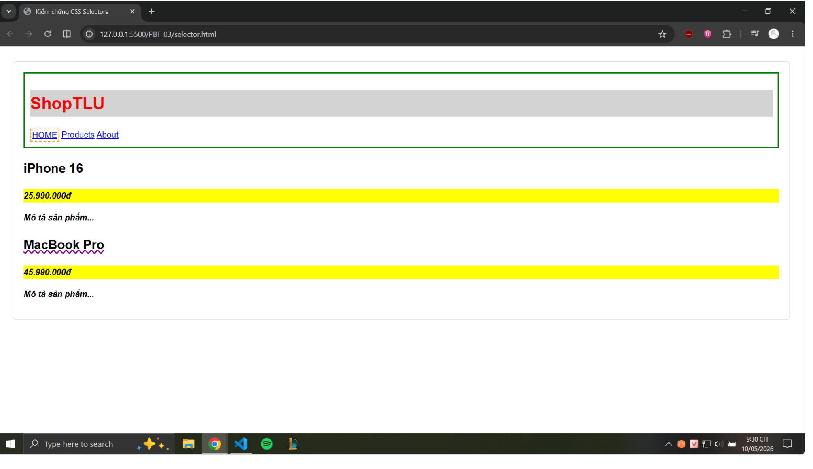
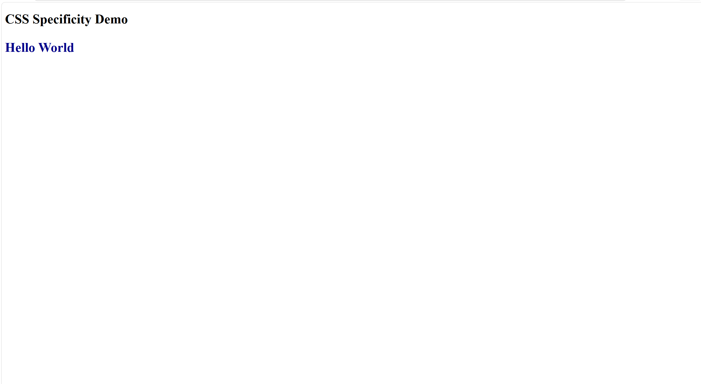
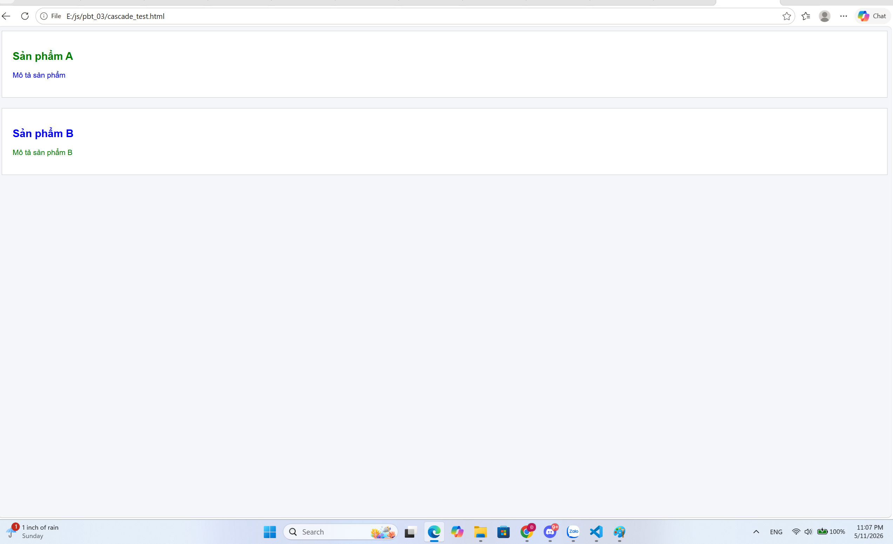

### Câu A1 — 3 Cách nhúng CSS:  
1. Inline CSS (CSS Nội tuyến):
    - Ví dụ: `
Text
`
    - Ưu điểm: Nhanh chóng, áp dụng trực tiếp lên thẻ với độ ưu tiên cao.
    - Nhược điểm: Khó bảo trì, không tái sử dụng được, làm HTML rối mắt.
    - Khi nào dùng: Dùng khi cần test nhanh một style hoặc khi dùng JavaScript để thay đổi style động.
2. Internal CSS (CSS Nội bộ):
    - Ví dụ: `` đặt trong thẻ `<head>`.
    - Ưu điểm: Giữ mã CSS ở một nơi trong file, có thể sử dụng các CSS Selectors để nhắm mục tiêu.
    - Nhược điểm: Không thể chia sẻ mã CSS này cho các trang HTML khác. Phải copy code nếu có nhiều trang.
    - Khi nào dùng: Khi làm một trang web đơn lẻ (Landing page 1 trang) hoặc viết email template.
3. External CSS (CSS Ngoại vi):
    - Ví dụ: `<link rel="stylesheet" href="style.css">`.
    - Ưu điểm: Tách biệt hoàn toàn HTML và CSS, dễ bảo trì, tái sử dụng cho nhiều trang, trình duyệt có thể lưu cache giúp tải trang nhanh hơn.
    - Nhược điểm: Tạo ra một HTTP request phụ để tải file CSS.
    - Khi nào dùng: Khuyên dùng cho hầu hết tất cả các dự án thực tế.  

Câu hỏi thêm: Nếu cùng 1 element có cả 3 cách CSS đồng thời áp dụng, Inline CSS sẽ "thắng" vì nó được áp dụng trực tiếp lên thẻ, mang độ ưu tiên (Specificity) cao nhất (1,0,0,0) so với internal và external.  
### Câu A2 — CSS Selectors:
1. h1 → Chọn: `<h1>ShopTLU</h1>` (Text: "ShopTLU")
2. .price → Chọn: Cả 2 thẻ `
` (Text: "25.990.000đ" và "45.990.000đ")
3. #app header → Chọn: Khối thẻ `<header class="top-bar dark">...</header>` nằm trong #app
4. nav a:first-child → Chọn: `<a href="/" class="active">Home</a>` (Text: "Home")
5. .product.featured h2 → Chọn: `<h2>MacBook Pro</h2>` (Thẻ h2 nằm trong element có cả 2 class product và featured) (Text: "MacBook Pro")
6. article > p → Chọn: Tất cả các thẻ `
` là con trực tiếp của `<article>` (Text: "25.990.000đ", "Mô tả sản phẩm...", "45.990.000đ", "Mô tả sản phẩm...")
7. a[href="/"] → Chọn: `<a href="/" class="active">Home</a>` (Text: "Home")
8. .top-bar.dark h1 → Chọn: `<h1>ShopTLU</h1>` (Thẻ h1 nằm trong element có 2 class top-bar và dark) (Text: "ShopTLU")  

Screenshot:  
  
### Câu A3 — Box Model:
- Trường hợp 1 (content-box):
    - Chiều rộng hiển thị (Visible Width) = Content (400px) + Padding L/R (40px) + Border L/R (10px) = 450px.
    - Không gian chiếm trên trang = Visible Width (450px) + Margin L/R (20px) = 470px.
- Trường hợp 2 (border-box):
    - Chiều rộng hiển thị = 400px (Thuộc tính width đã bao gồm cả padding và border).
    - Kích thước content thực tế = 400px - Padding L/R (40px) - Border L/R (10px) = 350px.
    - Không gian chiếm trên trang = 400px + Margin L/R (20px) = 420px.
- Trường hợp 3 (Margin collapse):
    - Khoảng cách giữa box-a và box-b = 40px.
    - Giải thích: Margin dọc của 2 block elements nằm kề nhau sẽ xảy ra hiện tượng collapse (gộp lại), trình duyệt sẽ lấy giá trị margin lớn nhất (max) thay vì cộng dồn hai giá trị lại với nhau.
- Nâng cao: Khoảng cách = 40px + (-10px) = 30px. Khi có margin âm, trình duyệt sẽ lấy margin dương lớn nhất cộng đại số với margin âm nhỏ nhất. 

### Câu A4 — Specificity (Độ ưu tiên):
1. Tính điểm Specificity:
    - Rule A: p → (0, 0, 1) (1 Element)
    - Rule B: .price → (0, 1, 0) (1 Class)
    - Rule C: #main-price → (1, 0, 0) (1 ID)
    - Rule D: p.price → (0, 1, 1) (1 Class, 1 Element)
2. 
- Element sẽ có màu đỏ (red). 
- Giải thích: Vì Rule C sử dụng ID selector nên có điểm specificity cao nhất (1,0,0), đánh bại các selectors còn lại.
3. Nếu thêm style nội tuyến (inline style) style="color: orange;", element sẽ có màu cam (orange) vì Inline style có độ ưu tiên cao hơn ID selector.
4. 
- Nếu Rule A thêm !important, element sẽ có màu đen (black). 
- Giải thích: !important là một ngoại lệ, nó có sức mạnh phá vỡ mọi quy tắc specificity và đánh bại cả Inline CSS.  
### Bài B2 - Box Model Lab:  
**Phần 1:**
- Hộp 1 (content-box): chiều rộng thực tế = 350px (đo từ DevTools).
    - Tính toán: 300px (content) + 20px2 (padding) + 5px2 (border) = 350px.

- Hộp 2 (border-box): chiều rộng thực tế = 300px (đo từ DevTools).
    - Tính toán: Tổng chiều rộng đã bao gồm cả padding và border là 300px. Phần content thực tế bên trong chỉ còn 250px (300 - 40 - 10).

- Giải thích sự khác biệt: Trong chế độ content-box, thuộc tính width chỉ định nghĩa chiều rộng của vùng nội dung, khiến tổng chiều rộng hiển thị bị phình to khi thêm padding và border. Ngược lại, border-box ép tổng chiều rộng hiển thị đúng bằng giá trị width, giúp việc tính toán layout chính xác và dễ dàng hơn.  
**Phần 2**
- Dùng border-box:

- Không dùng border-box:

### Bài B3 — Specificity Battle

**1. Liệt kê 10 rules + specificity score:**
1. `*` → Specificity: (0,0,0)
2. `p` → Specificity: (0,0,1)
3. `.text` → Specificity: (0,1,0)
4. `p.text` → Specificity: (0,1,1)
5. `.text.highlight` → Specificity: (0,2,0)
6. `p.text.highlight` → Specificity: (0,2,1)
7. `#demo` → Specificity: (1,0,0)
8. `p#demo` → Specificity: (1,0,1)
9. `#demo.text.highlight` → Specificity: (1,2,0)
10. `p#demo.text.highlight` → Specificity: (1,2,1)

**2. Element cuối cùng hiển thị màu gì? Tại sao?**
- Chữ "Hello World" cuối cùng sẽ hiển thị màu **đỏ (red)**.
- **Giải thích:** Trình duyệt so sánh điểm Specificity để quyết định Rule nào sẽ "thắng". Rule số 10 (`p#demo.text.highlight`) kết hợp cùng lúc 1 Element, 1 ID và 2 Classes nên mang số điểm (1,2,1) — cao nhất trong tất cả 10 rules. 

**3. Chụp screenshot kết quả**

**4. Thay đổi thứ tự rules trong CSS file. Kết quả có đổi không? Giải thích.**
- Kết quả **KHÔNG** thay đổi (chữ vẫn màu đỏ). 
- **Giải thích:** Khái niệm "Cascade" (Rule viết ở dưới cùng sẽ ghi đè Rule viết ở trên) **chỉ có tác dụng khi hai rule có số điểm Specificity bằng nhau**. Ở đây, vì 10 rule có điểm Specificity hoàn toàn khác nhau và chênh lệch rõ rệt, trình duyệt sẽ luôn chọn rule có điểm ưu tiên cao nhất bất kể nó được viết ở dòng số 1 hay dòng số 100 trong file CSS.  
### Câu C1 — Debug CSS Layout
1. Tính chiều rộng thực tế của sidebar và content (content-box!)
    - Theo mặc định của trình duyệt (box-sizing: content-box), chiều rộng thực tế của một phần tử sẽ bằng width + padding (trái/phải) + border (trái/phải).
    - Chiều rộng thực tế của .sidebar: 300px (width) + 40px (padding 2 bên) + 2px (border 2 bên) = 342px.
    - Chiều rộng thực tế của .content: 660px (width) + 60px (padding 2 bên) + 2px (border 2 bên) = 722px.  
2. Giải thích tại sao layout bị vỡ
    - Tổng không gian mà 2 phần tử này chiếm dụng trên chiều ngang là: 342px + 722px = 1064px.
    - Vì tổng chiều rộng thực tế (1064px) đã vượt quá chiều rộng của phần tử cha chứa nó (.container chỉ có 960px), nên phần tử .content không còn đủ chỗ để đứng cạnh .sidebar và bị rớt xuống dòng mới.
3. Đưa ra 2 cách sửa khác nhau
    - Cách 1 (Dùng border-box): Thêm thuộc tính box-sizing: border-box; cho cả .sidebar và .content. Khi dùng cách này, trình duyệt sẽ ép tổng kích thước (bao gồm cả padding và border) bằng đúng giá trị width khai báo ban đầu. Do đó, tổng chiều rộng sẽ là 300px + 660px = 960px.
    - Cách 2 (Không dùng border-box - Tự trừ hao width): Vẫn giữ nguyên content-box mặc định, nhưng ta phải trừ đi kích thước của padding và border khỏi giá trị width.
        - Sidebar sửa thành: width: 258px; (300 - 40 - 2)
        - Content sửa thành: width: 598px; (660 - 60 - 2)
### Câu C2 — Cascade Puzzle
1. "Sản phẩm A" (h2) có font-size = ? và color = ?
- font-size = 20px.
    - Giải thích: Thẻ h2 này chịu tác động trực tiếp từ rule .card .title { font-size: 20px; }. Rule này ghi đè các giá trị font-size được kế thừa từ .container (14px) và body (16px) do có độ ưu tiên (specificity) cao hơn khi nhắm mục tiêu trực tiếp.
- color = green.
    - Giải thích: Có 2 rule nhắm trực tiếp vào màu sắc của thẻ này: #featured .title { color: red; } và .highlight { color: green !important; }. Mặc dù selector chứa ID (#featured .title) có điểm specificity cao hơn (1,1,0 so với 0,1,0), nhưng từ khóa !important trong class .highlight có sức mạnh tuyệt đối, phá vỡ mọi quy tắc specificity thông thường và giành chiến thắng.
2. "Mô tả sản phẩm" (p trong card featured) có color = ?
- color = blue.
    - Giải thích: Thẻ p này bị tác động bởi rule .card p { color: inherit; }. Giá trị inherit ép phần tử này phải lấy chính xác giá trị computed màu sắc từ phần tử cha trực tiếp của nó. Phần tử cha là `
` đang được áp dụng rule .card { color: blue; }. Do đó, thẻ p kế thừa màu blue.
3. "Sản phẩm B" (h2) có font-size = ? và color = ?
- font-size = 20px.
    - Giải thích: Tương tự như Sản phẩm A, nó bị nhắm mục tiêu trực tiếp bởi rule .card .title { font-size: 20px; }.
- color = blue.
    - Giải thích: Thẻ h2 này không có class .highlight và cũng không nằm trong thẻ cha có id #featured. Vì không có bất kỳ rule màu sắc nào nhắm trực tiếp đến nó, nó sẽ tự động kế thừa (inherit) màu sắc từ thẻ cha gần nhất là `
`. Thẻ cha có .card { color: blue; }, nên h2 cũng có màu blue.
4. "Mô tả sản phẩm B" (p.highlight) có color = ?
- color = green.
    - Giải thích: Có 2 rule nhắm tới thẻ này là .card p { color: inherit; } và .highlight { color: green !important; }. Một lần nữa, sự xuất hiện của cờ !important sẽ đánh bại quy tắc kế thừa inherit, ép phần tử hiển thị màu green.  

Screenshot:
